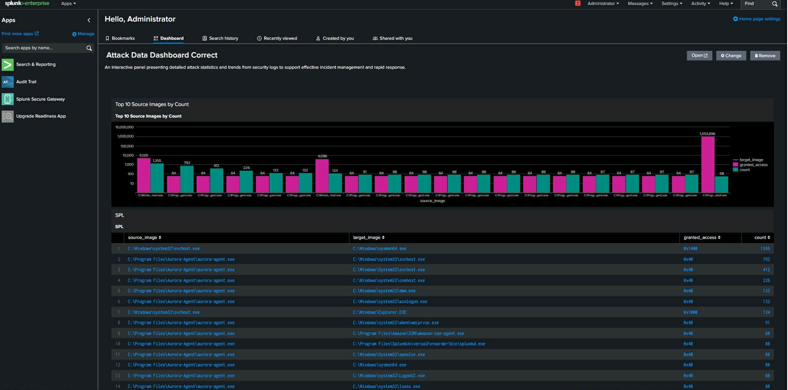
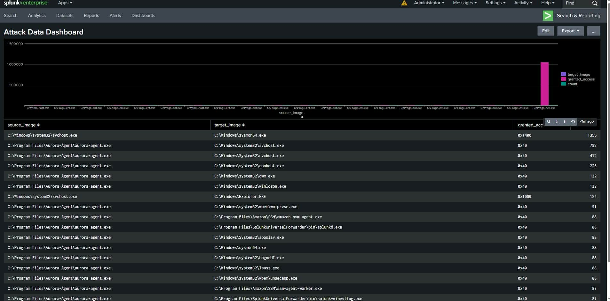
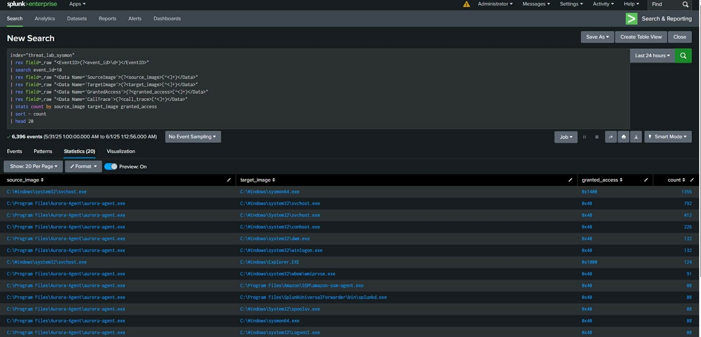

# splunk-sysmon-threat-hunting

## Overview
This project demonstrates a practical implementation of a security monitoring and threat hunting pipeline using Splunk Enterprise. 
The lab focuses on analyzing high-fidelity endpoint telemetry provided by Windows Sysmon (specifically Event ID 10 - Process Access) and the Aurora Incident Response Agent. 
The primary goal was to build interactive dashboards that translate raw, unstructured XML event data into actionable security insights, focusing on process forensics, privilege escalation attempts, and credential dumping detection (e.g., unauthorized access to `lsass.exe`).

## Features
- **Custom Log Parsing:** Used SPL `rex` commands to manually extract critical fields (`SourceImage`, `TargetImage`, `GrantedAccess`) from raw, unstructured XML event logs.
- **Data Correlation:** Developed queries using `stats`, `sort`, and data aggregation techniques to link source processes with targeted images.
- **Dashboarding:** Built a dashboard panel (Bar Charts and Tables) to visualize the top active source processes and their access levels.

## Tech Stack
- Splunk Enterprise
- Windows Sysmon & Aurora Agent
- SPL (Search Processing Language)
- Publicly available Sysmon datasets (Security Research Datasets via GitHub)

## Usage
1. **Ingest the dataset:** Upload your Sysmon/Aurora logs to a dedicated index (e.g., `threat_lab_sysmon`).
2. **Install parsing Add-ons:** Install the `Splunk Add-on for Microsoft Windows` to ensure proper field extraction and CIM mapping.
3. **Execute Analysis:** Navigate to **Search & Reporting** and use the provided SPL queries to hunt for threats.
4. **Build Dashboards:** Create new dashboard panels and paste the SPL queries to visualize event distributions and forensic data.
   
## Dashboards
- Splunk_main_dashboard

  
  
- Splunk_process_forensics

  
  
- Splunk_event_distribution

  
